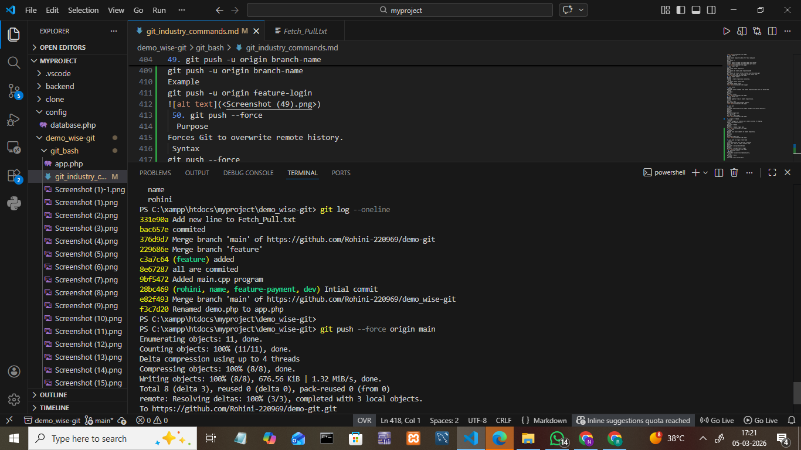

1. git config --global user.name
syntax:git config --global user.name "Your Name"
purpose:sets the username globally for all repositories

2. git config --global user.email
syntax:git config --global user.email"your@email.com"
purpose: sets email globally for commit identification
-1.png>)
.png>)
.png>)
3. git config --list
syntax:git config --list
Purpose:
Displays all configured Git settings.
Example:
git config --list

.png>)
4. git config --unset
Syntax:
git config --unset user.name
Purpose:
Removes a configuration value.
Example:
git config --unset user.name

.png>)
5. git init
Syntax:
git init
Purpose:
Initializes a new Git repository.
Example:
git init
.png>)
6. git clone
Syntax:
git clone <repository-url>
Purpose:
Creates a copy of a remote repository.
Example:
git clone https://github.com/username/project.git
.png>)
7. git clone --branch
Syntax:
git clone --branch branch-name <repo-url>
Purpose:
Clones a specific branch.
Example:
git clone --branch develop https://github.com/username/project.git
.png>)
8. git clone --depth
Syntax:
git clone --depth <number> <repo-url>
Purpose:
Performs shallow clone (latest commit only).
Example:
git clone --depth 1 https://github.com/username/project.git
.png>)
9. git status
syntax:
git status
purpose:
Shows working directory status.
Example:
git status
.png>)
 10. git log
syntax:git log
purpose:
Shows full commit history.
Example:
git log
.png>)
11. git log --oneline
syntax:git log --oneline
purpose:
Compact log view. it shows commit history in short format
Example:
git log --oneline
 copy.png>)
12. git log --graph
syntax:
git log --graph
purpose:
Graphical branch view.shows the branch structure visually using lines and stars
better version:
git log --graph --oneline --all
.png>)
13. git show
syntax:git show
purpose:

Shows detail information  of a  specified commit.
example:
git show <commit-id>

.png>)
14. git diff
syntax: git diff
purpose:
Shows unstaged changes. shows difference between files
example:
git diff
.png>)
15. git diff --staged
syntax: git  diff --staged
purpose:
Shows staged changes. shows changes that are added but not commited
Example:
git diff --staged
.png>)

16.git blame
syntax:git blame
purpose:
git blame shows who last modified each line of a file

Example:
git blame filename.txt
.png>)
17. git reflog
syntax:git reflog
purpose:
Shows reference log history.
 shows the history of where your HEAD and branches have pointed
example:
git reflog
.png>)

18. git shortlog
syntax:git shortlog
purpose:
Summarizes commit history by author.
example:
git shortlog

.png>)
file tracking commands
19. git add
syntax:git add
purpose:
Adds specific file or folder  or all files.
example:
git add git file.txt
.png>)
20. git add .
purpose:
Adds all files.
example:
git add .
.png>)
21. git add -p
purpose:
Interactive staging.
add changes interactively in small pieces (hunks)
example:
git add -p
.png>)
22. git restore
syntax: git restore
purpose:
Restores working directory file. used to edit a file but want  to undo changes 
example:
git restore file.txt
.png>)

23. git restore --staged
syntax: git restore --staged
purpose:
unstages a file (removes from staging area) But keeps your change in the working directroy
used when you accidently did git add.
.png>)
24. git rm
syntax:git rm
purpose: 
deletes a file from working directory and staging area
used when you want to permenently  removes a file from the repository
.png>)

25. git mv
syntax: git mv
purpose:
rename a file and move a file to another folder and automatically stage the change
git mv only works for files that are already:
Added using git add
Committed at least once
.png>)

commit commands
26. git commit
syntax: git commit
purpose: 
saving your changes permanently into git history
git add-select changes 
git commit - save changes
.png>)

27. git commit -m
syntax:git commit -m " <something in string>"
purpose:
creates a commit with message directly in terminal

.png>)
28. git commit --amend
syntax: git commit --amend
purpose: 
change last commit message
add forgotten files
editor opens ->change message ->save

.png>)
29. git commit --no-edit
Syntax:
git commit --amend --no-edit

 Purpose:
--no-edit means:
 Do not change the previous commit message
It keeps the same message.

.png>)
Branch Management Commands
30. git branch
Purpose
Shows all local branches in your repository.
Syntax
git branch
Example
git branch
.png>)
31. git branch -a
Purpose
Shows all branches (local + remote).
Syntax
git branch -a
Example
 main
  develop
  remotes/origin/main
  remotes/origin/develop
.png>)

32. git branch -d
 Purpose
Deletes a branch safely.
Git deletes the branch only if it is already merged.
Syntax
git branch -d branch_name
Example
git branch -d feature
Branch deleted only if merged.
.png>)
33. git branch -D
 Purpose
Force delete branch.
Even if it is not merged.
Syntax
git branch -D branch_name
Example
git branch -D feature
.png>)
34. git checkout
Purpose
Used to switch branches or restore files.
 Syntax
git checkout branch_name
Example
git checkout develop
.png>)
 35. git checkout -b
Purpose
Creates new branch + switches to it.
Syntax
git checkout -b branch_name
Example
git checkout -b feature-login
Result:
Branch created
Automatically switched to it
.png>)
36. git switch
This is a modern command introduced later in Git to replace checkout for branch switching.
 Purpose
Switch branches.
 Syntax
git switch branch_name
 Example
git switch main
.png>)
37. git switch -c
 Purpose
Create new branch and switch to it.
 Syntax
git switch -c branch_name
Example
git switch -c feature-payment
 Branch created
 Switched immediately.
.png>)

 Merge & Integration Commands
  38. git merge
Purpose
git merge is used to combine changes from one branch into another branch.
Example:
You developed a feature in a branch and now want to add it to the main branch.
 Syntax
git merge branch_name
It merges branch_name -> current branch.
.png>)

39.  git merge --no-ff Means
--no-ff means No Fast-Forward Merge.
It forces Git to create a merge commit, even if a fast-forward merge is possible.
This keeps the feature branch history visible.
 Syntax
git merge --no-ff branch_name
.png>)
 Remote Repository Commands

40. git remote
Purpose
Shows the remote repository names connected to your local repository.
Syntax
git remote
Example
origin
origin = default remote repository.
.png>)
41. git remote -v
Purpose
Shows remote repository URLs for fetch and push.
Syntax
git remote -v
Example
origin  https://github.com/rohini/demo.git (fetch)
origin  https://github.com/rohini/demo.git (push)
.png>)
42. git remote add
Purpose
Adds a new remote repository.
Syntax
git remote add remote_name repository_URL
Example
git remote add origin https://github.com/rohini/demo.git
Now your local repo is connected to the remote repo.
-1.png>)
43. git remote remove
Purpose
Removes a remote repository connection.
 Syntax
git remote remove remote_name
 Example
git remote remove origin
-1.png>)

44. git fetch
 Purpose
Downloads latest changes from remote repository but does not merge them.
 Syntax
git fetch
Example
git fetch origin
.png>)
45. git fetch --all
Purpose
Fetches updates from all remote repositories.
Syntax
git fetch --all
Useful when you have multiple remotes.

.png>)
46. git pull
Purpose:
Downloads and automatically merges changes from remote repository.
Syntax:
git pull
Example:
git pull origin main
This performs:
git fetch + git merge
.png>)

47. it pull --rebase
 Purpose
Fetches changes and rebases your commits instead of merging.
Keeps clean commit history.
 Syntax
git pull --rebase
Example
git pull --rebase origin main 
.png>)
48. git push
 Purpose
Uploads your local commits to remote repository.
Syntax
git push
Example
git push origin main
.png>)

49. git push -u origin branch-name
 Purpose
Pushes branch and sets upstream tracking.
After this, you can simply use git push.
Syntax
git push -u origin branch-name
Example
git push -u origin feature-login
.png>)
 50. git push --force
  Purpose
Forces Git to overwrite remote history.
 Syntax
git push --force
 Example
git push --force origin main

stash commands

51. git stash
 Purpose
Temporarily save your uncommitted changes and make the working directory clean.
Useful when you want to switch branches without committing.
 Syntax
git stash
 Example
Suppose you edited main.cpp but didn’t commit yet.

.png>)

 52. git stash list
 Purpose
Shows all stored stashes.
Syntax
git stash list
Example Output
stash@{0}: WIP on main: Added login feature
stash@{1}: WIP on develop: Updated UI
.png>)
53. git stash pop
 Purpose

Restores the latest stash and removes it from stash list.
Syntax
git stash pop
 Example
git stash pop
Result:
Changes restored
.png>)

54. git stash apply
Purpose

Restores the changes from a stash but keeps the stash in the stash list.

 Syntax
git stash apply
 Example
git stash list
Output:

stash@{0}: WIP on main: Added login feature
stash@{1}: WIP on main: Updated UI
.png>)
55. git stash drop
Purpose

Deletes one specific stash from the stash list.

Syntax
git stash drop stash@{number}

Example
git stash list
.png>)
 56. git stash clear
 Purpose

Deletes ALL stashes permanently.
 Syntax
git stash clear
Example
.png>)
10.Reset & Undo Commands
 57. git reset
Purpose

Moves the HEAD pointer to a previous commit.

It can also unstage files depending on the option used.

Syntax
git reset <commit-id>

 Example
git reset HEAD~1
.png>)
58. 
git reset --soft
 Purpose

Moves HEAD to a previous commit but keeps changes staged.

What happens:
Area	Status
Working Directory	Changes kept
Staging Area	Changes kept
Commit History	Last commit removed
 Syntax
git reset --soft HEAD~1

Example

Before
Commit1 → Commit2 → Commit3 (HEAD)
 .png>)
59. git reset --mixed
Purpose:
Undo the last commit and unstage the files, but keep changes in working directory.
Syntax:
git reset --mixed <commit-id>
Example:

git reset --mixed HEAD~1
.png>)

60.  git reset --hard

Purpose:
Resets the repository to a specific commit and deletes all changes in the working directory and staging area.
Syntax
git reset --hard <commit-id>
Example
git reset --hard a1b2c3d

61. git revert

Purpose:
Creates a new commit that reverses the changes of a previous commit.
Syntax
git revert <commit-id>
Example
git revert a1b2c3d
.png>)
62. git clean -f
Purpose:
Removes untracked files from the working directory.
Syntax
git clean -f
Example
git clean -f
.png>)
 63. git clean -fd
Purpose:
Removes untracked files and directories.
Syntax
git clean -fd
Example
git clean -fd
.png>)
11. Rebasing Commands
 
64. git rebase
Purpose:
Moves or reapplies commits from one branch to another.
Syntax
git rebase <branch-name>
Example
git rebase main
.png>)

 65. git rebase -i
Purpose:
Interactive rebase to edit, combine, or reorder commits.
Syntax
git rebase -i HEAD~n
Example

git rebase -i HEAD~3
.png>)
 66. git rebase --abort
Purpose:
Cancels the rebase operation and restores the previous state.
Syntax
git rebase --abort
.png>)

67. git rebase --continue
Purpose:
Continues the rebase process after resolving conflicts.
Syntax
git rebase --continue

12. Cherry Pick & Patch Commands
68. git cherry-pick

Purpose:
Applies a specific commit from another branch.
Syntax
git cherry-pick <commit-id>
Example

git cherry-pick a1b2c3d
.png>)
69. git apply
Purpose:
Applies a patch file to the working directory.
Syntax

git apply <patch-file>
Example
git apply update.patch
.png>)
70. git am

Purpose:
Applies patches generated by git format-patch.
Syntax
git am <patch-file>
Example
git am 0001-update.patch
Applies patch + commit
.png>)

13. Tagging Commands
71. git tag

Purpose:
Creates a tag for a specific commit.
Syntax
git tag <tag-name>
Example
git tag v1.0
.png>)
72. 
git tag -a
Purpose:
Creates an annotated tag with a message.
Syntax
git tag -a <tag-name> -m "message"
Example

git tag -a v1.0 -m "First release"
-1.png>)
73. 
git tag -d
Purpose:
Deletes a tag.
Syntax
git tag -d <tag-name>
Example
git tag -d v1.0
-2.png>)
74. 
git push origin --tags
Purpose:
Pushes all tags to the remote repository.
Syntax
git push origin --tags
-3.png>)
14. Submodule Commands
75. git submodule add
Purpose:
Adds another repository inside your project.
Syntax
git submodule add <repository-url>

Example

git submodule add https://github.com/example/project.git
.png>)
76. 
git submodule init

Purpose:
Initializes submodules.

Syntax

git submodule init
.png>)
77. git submodule update

Purpose:
Updates submodules to the correct commit.
Syntax
git submodule update
-1.png>)

15. Debugging Commands
78. git bisect
Purpose:
Helps find the commit that introduced a bug.

Syntax
git bisect

